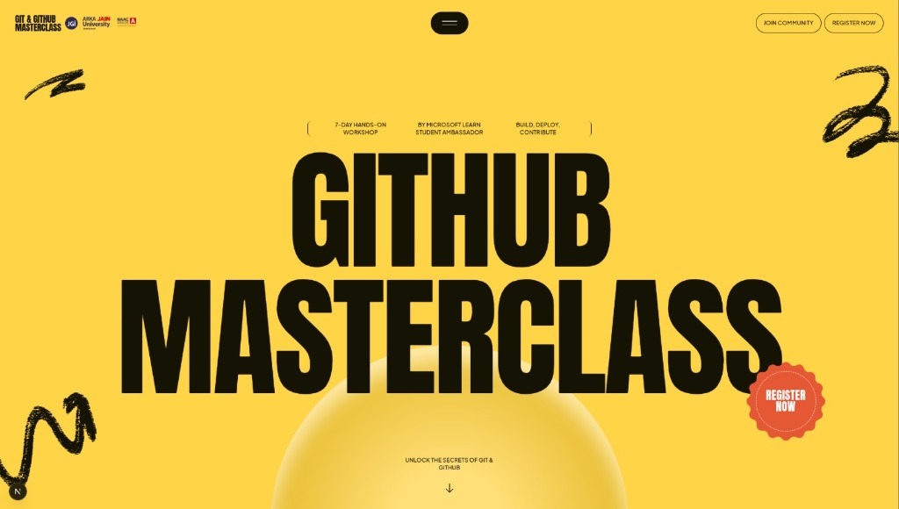
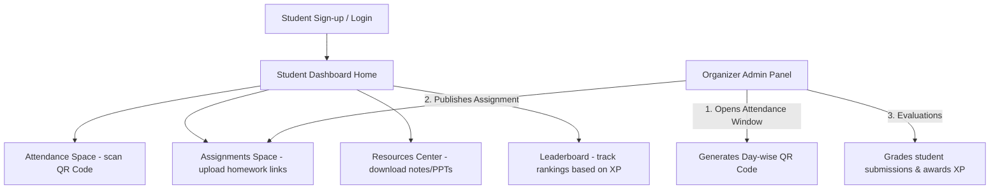

# 

<div align="center">

# Git & GitHub Masterclass LMS
### Version control, not confusion.

[](https://nextjs.org/)
[](https://www.typescriptlang.org/)
[](https://supabase.com/)
[]()

**Git & GitHub Masterclass LMS** is a full-stack, gamified Learning Management System designed to handle registrations, track live attendance, manage assignments, and showcase peer leaderboards for the Microsoft Learn Student Ambassador workshop at Arka Jain University.

[Features](#-key-features) • [Workflow](#-system-workflow) • [Tech Stack](#-technology-stack) • [Getting Started](#%EF%B8%8F-getting-started) • [Deployment](#-deployment)

---

</div>

## 🔄 System Workflow



---

## 🚀 Key Features

*   **⚡ Real-time Student Pass**: Custom student pass generated with automatic cache-busting profile photo uploads.
*   **✂️ Interactive Photo Cropper**: Custom client-side Canvas-based cropping modal to zoom, pan, and align avatars inside the circular badge frame.
*   **📅 QR Attendance System**: Day-wise QR Code check-in system controlled by organizers with dynamic active check-in windows.
*   **🎮 XP & Streak Gamification**: Students earn 50 XP per attendance log and 100 XP per graded assignment to build their daily learning streak.
*   **📊 Comprehensive Leaderboard**: Live rankings of peers based on their real-time completed session metrics and XP points.
*   **🛠️ Offline-First Local Fallback**: Seamless offline support. If Supabase keys are missing, the system gracefully falls back to local JSON data files to allow offline development and testing.

---

## 🛠️ Technology Stack

| Layer | Technology | Description |
| :--- | :--- | :--- |
| **Framework** | Next.js 16 (App Router) | Native full-stack framework with Turbopack compilation |
| **Frontend** | React & Tailwind/Vanilla CSS | Immersive Neo-brutalist theme visual design |
| **Backend** | Serverless Routes | Optimized endpoint controllers for auth, attendance, and evaluation |
| **Database** | Supabase PostgreSQL | Fully managed SQL schema with RLS security policies |
| **Storage** | Supabase Storage | Dynamic public buckets for user profile image uploads |

---

## ⚡ Getting Started

### 1. Clone & Install
```bash
git clone https://github.com/mohitraj8503/Git-GitHub-Masterclass.git
cd Git-GitHub-Masterclass
npm install
```

### 2. Configure Environment
Create a `.env.local` file in the root directory:
```env
NEXT_PUBLIC_SUPABASE_URL=https://<your-project-id>.supabase.co
NEXT_PUBLIC_SUPABASE_ANON_KEY=<your-anon-key>
SUPABASE_SERVICE_ROLE_KEY=<your-service-role-key>
```

### 3. Initialize Schema
Run [scripts/supabase_schema.sql](scripts/supabase_schema.sql) and [scripts/supabase_lms_schema.sql](scripts/supabase_lms_schema.sql) inside your Supabase SQL Editor.

### 4. Start Local Dev
```bash
npm run dev
```

---

## ☁️ Deployment

Deploy easily for free on **Vercel**:
1. Connect your GitHub repository to Vercel.
2. Add your `.env.local` environment variables to the project configuration.
3. Click **Deploy** — Vercel builds the full-stack routing instantly.

---
*Organized by Microsoft Learn Student Ambassador · Arka Jain University*
